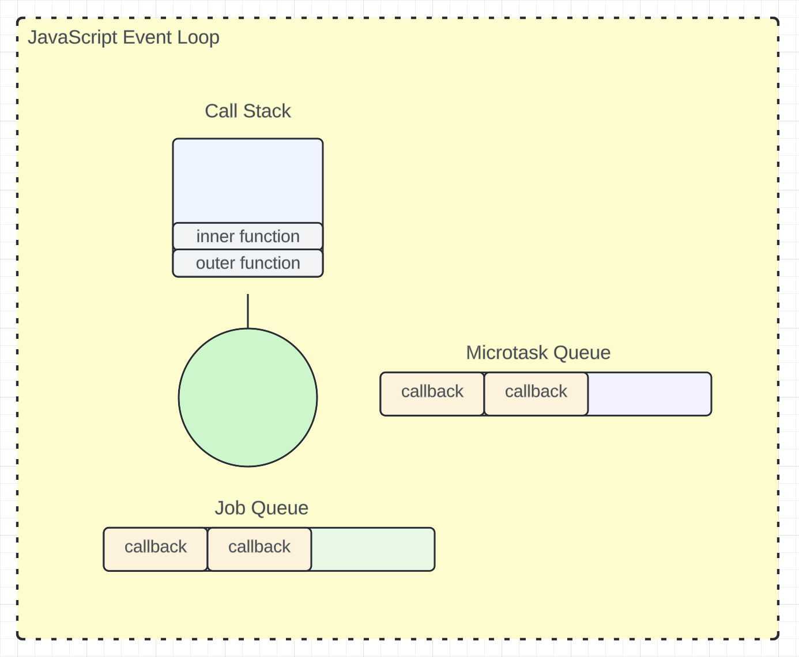

## Node.js

JavaScript was originally created to run in the browser, but with Ryan Dahl's creation of Node.js, it can now run
outside of the browser. Node.js is a JavaScript runtime that uses the Chrome V8 engine to execute JavaScript code
and `libuv` to provide asynchronous I/O operations through an event-driven, non-blocking architecture.

#### `libuv`
This is a library written in C/C++ that talks to the operating system to execute work.  The library has been built
to work with many operating systems, including Unix and Microsoft.  It is used by other languages like Python to
provide asynchronous features, like reading a file, making a network request, etc.  Node.js uses `JS bindings`
to talk to `libuv`.

### JavaScript

JavaScript is inherently single-threaded, meaning it runs on a single main thread.  This thread has a `memory heap`
and a `call stack`.  The `memory heap` is where values for our code's variables are stored.  The `call stack` is
where functions are placed when they are invoked, and it's responsible for keeping track of the function calls
in the order they need to be executed.  In a browser, each tab typically runs on one thread.  JavaScript's
non-blocking or asynchronous behavior is achieved through the `event loop`, which is provided by the
environment in which it runs, such as browsers or Node.js. Each thread has an `event loop` and, on
the browser, `Web API`, and in Node.js, `libuv`.

When JavaScript runs, it executes code from top-to-bottom, one line at a time.  JavaScript code execution
involves two main phases during compilation: the `creation phase` (aka `memory allocation phase`), where
the environment sets up the memory space for variables and functions, and the `execution phase`, where
these variables are assigned values and functions are invoked.

#### Creation Phase
- variables declared using `var` are set to `undefined` and hoisted within nearest function scope (or global)
- variables declared using `let` and `const` are in `temporal dead zone` and are not yet initialized
- functions are allocated memory and hoisted within nearest function scope (or global)

#### Execution Phase
- when JS engine encounters a function invocation, it invokes this function by creating a new execution context
and starting the `creation phase` within the function's scope (everything inside the function)
- variables declared using `var` are assigned their values
- variables declared using `let` and `const` are initialized and assigned their values

### Event Loop

Key components associated with the `event loop` include the `call stack`, `memory heap`, `callback queue`,
`microtask queue`, and the environment's APIs (such as Web APIs in browsers or libuv in Node.js).  The
`event loop` is like a while loop, with the following pseudo-code:

```
while (true) {
    if the call stack has a function, execute it and continue
    else check if the microtask has a callback
        if there's a callback in the microtask queue, put the callback in the call stack and continue
        else check the job queue or callback queue
            if there is a callback in the job queue, put the callback in the call stack and continue
            else continue
}
```




#### `call stack`

Synchronous code is executed, in last-in-first-out (stack) order.

#### `microtask queue`

This is the newest queue added to the `event loop`.  This is the queue for callbacks to `Promises` and
`MutationObserver`.  This has a higher priority than the `callback queue` and so is first checked when
the `call stack` is empty.  This queue must be empty before the `event loop` can then work on
callbacks from the `callback queue`.

#### `callback queue` (aka `job queue`)

This is the queue for callbacks that come from asynchronous calls like:
- `setInterval`
- `setTimeout`
- I/O operations like reading a file
- event listeners


#### Example Code

```
console.log('Start');

setTimeout(() => {
  console.log('Timeout callback');
}, 0);

Promise.resolve()
  .then(() => {
    console.log('Promise then');
  })
  .then(() => {
    console.log('Promise second then');
  });

console.log('End');

```

Expected output
```
Start
End
Promise then
Promise second then
Timeout callback
```
